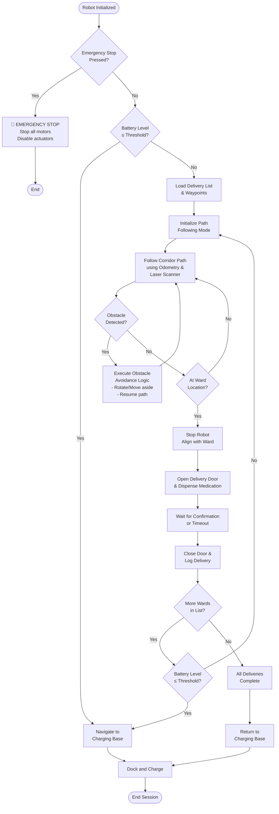

# Robotics Systems and Simulation – Mock Exam 2

## Instructions

This is a mock exam for the module **Robotics Systems and Simulation**.

You are required to answer all questions.

There are 15 questions and 100 marks available:

* Ten MCQ (Multiple Choice Questions) worth 5 marks each.
* Three short-answer questions worth 5 marks each.
* One long mathematical modelling question worth 20 marks.
* One design/pseudo-code question worth 15 marks.

For the non-MCQ questions, marks are awarded based on understanding and working.

---

# Section A – Multiple Choice Questions (50 Marks)

## Question 1 (5 Marks)

In a closed-loop control system, the feedback signal is used to:

* A: Power the actuator directly
* B: Compare the output with the desired reference and reduce the error
* C: Measure the battery voltage
* D: Increase the system's inertia

Your answer: B

---

## Question 2 (5 Marks)

Which of the following best describes a transfer function in a control system?

* A: A physical description of a robot's geometry
* B: A time-domain representation of a signal
* C: The ratio of the Laplace transform of the output to the Laplace transform of the input
* D: A map of the robot's environment

Your answer: D

---

## Question 3 (5 Marks)

In ROS 2, which communication model is used for request-response interactions between nodes?

* A: Topics
* B: Actions
* C: Services
* D: Parameters

Your answer: A

---

## Question 4 (5 Marks)

Which of the following file formats is used to describe a robot's physical structure in ROS?

* A: CSV
* B: URDF
* C: JSON
* D: YAML

Your answer: B

---

## Question 5 (5 Marks)

A differential drive robot has two wheels. To make the robot turn on the spot, you should:

* A: Drive both wheels forward at the same speed
* B: Stop both wheels
* C: Drive both wheels in opposite directions at equal speeds
* D: Drive only the left wheel forward

Your answer: C

---

## Question 6 (5 Marks)

Which of the following sensors is best suited for detecting the colour of an object?

* A: Gyroscope
* B: Encoder
* C: RGB Camera
* D: IMU

Your answer: C

---

## Question 7 (5 Marks)

In Gazebo simulation, what is the role of a plugin?

* A: To render 3D graphics on the screen
* B: To extend simulation functionality, such as adding sensor or motor behaviour
* C: To write ROS node source code
* D: To store the robot's map data

Your answer: B

---

## Question 8 (5 Marks)

Which of the following is an example of a proprioceptive sensor?

* A: Ultrasonic rangefinder
* B: Camera
* C: Wheel encoder
* D: LIDAR

Your answer: C

---

## Question 9 (5 Marks)

In the context of robot kinematics, forward kinematics refers to:

* A: Calculating joint angles from a desired end-effector position
* B: Calculating the end-effector position from known joint angles
* C: Planning a collision-free path for the robot
* D: Measuring the torque at each joint

Your answer: B

---

## Question 10 (5 Marks)

Which of the following statements about a Proportional (P) controller is correct?

* A: It eliminates steady-state error completely
* B: It predicts future error to improve response
* C: It produces a control output proportional to the current error
* D: It integrates past errors to correct long-term drift

Your answer: C

---

# Section B – Short Questions (15 Marks)

## Question 11 (5 Marks)

Briefly explain the difference between open-loop and closed-loop control systems, and give one example of each.

Please fit your answer in four lines only.

Your answer: 
Open-loop control systems do not use feedback; they execute commands without monitoring output.
Closed-loop control systems use feedback to compare actual output with desired input and correct errors.
Example of open-loop: A washing machine that runs for a set time.
Example of closed-loop: A thermostat that adjusts heating based on room temperature.

---

## Question 12 (5 Marks)

What is odometry in robotics, and what are its main limitations?

Your answer: 

Odometry is the use of motion sesnors to determine the robots change in position releative to a know postion. This method provides good accuracy for the short-term measurement but it leads to a lot of error when done on significant displacement.

Uses:
* cab be used to estimate the postion to provide better estimats
* Robots can have enough stability so that they are able to detect the landmarks and are used for mapping in the limited region.


Limitations:
Systematic error is caused by inherent deficiencies or inaccuracies in the system such as:
Systematic: 
* Inaccuracies in wheel diameter.
* Inaccuracies in wheelbase.
* Misalignment of wheels.
* Finite encoder resolution.
* Finite encoder sampling rate.

Non-Systematic:
Uneven floor
Presence of unexpected objects on the floor
Wheel Slipperage, Overaccelaration, Fast turning.

---

## Question 13 (5 Marks)

Explain the role of the ROS Master (roscore) in a ROS 1 system. Why is it not required in ROS 2?

Your answer:

ROS Master roscore is a ROS 1 central coordinator that communicates between nodes, by managing the registration and discovery of services and topics. In ROS2 the master is not required as it used a distributed, non-centralized architecture meaning that Nodes can communicate directly without a central service. 

---

# Section C – Mathematical Modelling (20 Marks)

## Question 14 (20 Marks)

Derive the mathematical model of the series RC electrical circuit shown below, considering the voltage across the resistor V_R(t) as the output.

System:

* Input voltage = V(t)
* Resistance = R
* Capacitance = C
* Current through circuit = i(t)

**Steps to follow:**

1. Apply Kirchhoff's Voltage Law (KVL) around the loop.
2. Express the current i(t) in terms of the capacitor voltage V_C(t).
3. Write V_R(t) as a function of i(t) and R.
4. Substitute to obtain a single differential equation with V(t) as input and V_R(t) as output.

If you need to write derivatives, use:

* d/dt (x(t)) for the first derivative of x with respect to t
* int (x(t)) for the integral of x with respect to t

Your answer:

---

# Section D – Design / Pseudo-Code (15 Marks)

## Question 15 (15 Marks)

A Wheeled Mobile Robot (WMR) is deployed in a hospital environment to deliver medication between wards. The robot must follow a predefined corridor path, stop at each ward to deliver medication, and return to a charging base when its battery is low.

The robot is equipped with:

* A laser scanner for obstacle detection
* Wheel encoders for odometry
* A battery level sensor

As a Mechatronics Engineer, design the overall navigation and task management logic for this robot.

You may include:

* Path following behaviour
* Ward stop and delivery logic
* Obstacle detection and avoidance
* Battery monitoring and return-to-base logic
* Emergency stop

You may answer using:

* Pseudo-code
* Flowchart
* Diagram
* Combination of all three

Your answer:

## Flowchart: Navigation and Task Management Logic



## Pseudo-Code: Main Control Algorithm

```
CONSTANTS:
    BATTERY_THRESHOLD = 20%
    OBSTACLE_DISTANCE_MIN = 0.5m
    WARD_ARRIVAL_TOLERANCE = 0.1m
    DELIVERY_TIMEOUT = 30 seconds

VARIABLES:
    emergency_stop = false
    delivery_list = []
    current_ward_index = 0
    battery_level = 0
    robot_position = {x: 0, y: 0, theta: 0}
    obstacle_detected = false

MAIN_LOOP:
    INITIALIZE:
        load_delivery_list_from_database()
        initialize_sensors()
        initialize_actuators()
        robot_position = get_odometry()
    
    while system_active:
        // Priority 1: Emergency Stop Check
        if emergency_stop_button_pressed():
            emergency_stop = true
            stop_all_motors()
            disable_all_actuators()
            break
        
        // Priority 2: Battery Management
        battery_level = get_battery_level_sensor()
        if battery_level ≤ BATTERY_THRESHOLD:
            navigate_to_base()
            dock_and_charge()
            break
        
        // Priority 3: Deliver Medication to Each Ward
        if current_ward_index < length(delivery_list):
            current_ward = delivery_list[current_ward_index]
            target_waypoint = current_ward.coordinates
            
            // Navigate to Ward
            while not_at_waypoint(target_waypoint, WARD_ARRIVAL_TOLERANCE):
                // Check for obstacles every cycle
                laser_data = get_laser_scanner_data()
                obstacle_detected = check_obstacle_in_path(laser_data, OBSTACLE_DISTANCE_MIN)
                
                if obstacle_detected:
                    execute_obstacle_avoidance():
                        rotate_away_from_obstacle(90°)
                        move_forward(0.5m)
                        rotate_back_to_path()
                else:
                    // Follow path using odometry
                    robot_position = get_odometry()
                    calculate_path_error(robot_position, target_waypoint)
                    adjust_motor_speeds_using_PID()
                    send_velocity_commands_to_wheels()
            
            // At Ward: Perform Delivery
            stop_all_motors()
            align_with_ward(current_ward)
            open_delivery_door()
            dispense_medication(current_ward.medication_type, current_ward.quantity)
            
            wait_for_confirmation(timeout = DELIVERY_TIMEOUT)
            
            close_delivery_door()
            log_delivery_success(current_ward.id, timestamp)
            
            current_ward_index = current_ward_index + 1
        
        else:
            // All deliveries complete
            navigate_to_charging_base()
            dock_and_charge()
            reset_system()
            break

END_OF_MAIN_LOOP
```


---

# End of Mock Exam
