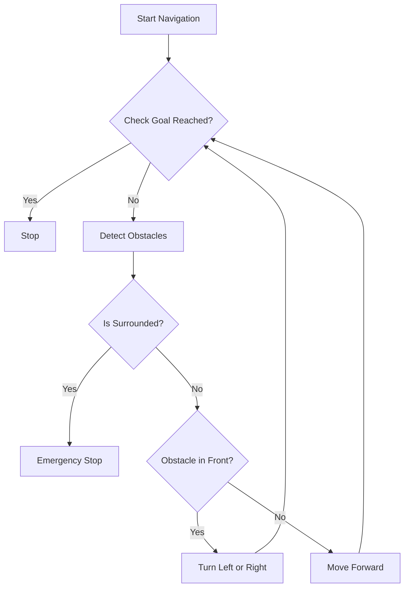
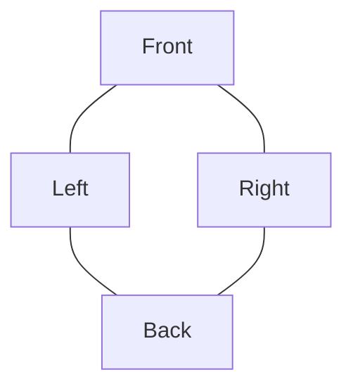

# Robotics Systems and Simulation – Mock Exam

## Instructions

This is a mock exam for the module **Robotics Systems and Simulation**.

You are required to answer all questions.

There are 15 questions and 100 marks available:

* Ten MCQ (Multiple Choice Questions) worth 5 marks each.
* Three short-answer questions worth 5 marks each.
* One long mathematical modelling question worth 20 marks.
* One design/pseudo-code question worth 15 marks.

For the non-MCQ questions, marks are awarded based on understanding and working.

---

# Section A – Multiple Choice Questions (50 Marks)

## Question 1 (5 Marks)

The main purpose of a PID controller is to:

* A: Increase battery life
* B: Improve system stability and response
* C: Reduce sensor size
* D: Increase mechanical friction

Your answer: B

---

## Question 2 (5 Marks)

Which sensor is commonly used for measuring angular velocity?

* A: Accelerometer
* B: Gyroscope
* C: Ultrasonic sensor
* D: GPS

Your answer: A

---

## Question 3 (5 Marks)

In ROS, nodes communicate using:

* A: Threads
* B: Registers
* C: Topics
* D: Arrays

Your answer: C

---

## Question 4 (5 Marks)

The purpose of a Kalman Filter is to:

* A: Increase motor torque
* B: Estimate noisy sensor measurements
* C: Generate robot meshes
* D: Improve battery voltage

Your answer: B

---

## Question 5 (5 Marks)

Which component stores energy in an electrical system using a magnetic field?

* A: Capacitor
* B: Resistor
* C: Inductor
* D: Diode

Your answer: A

---

## Question 6 (5 Marks)

Which ROS command is used to list active topics?

* A: ros2 node list
* B: ros2 service list
* C: ros2 topic list
* D: ros2 launch list

Your answer: D

---

## Question 7 (5 Marks)

The primary purpose of SLAM is to:

* A: Increase motor speed
* B: Simultaneously localise and map the environment
* C: Improve WiFi performance
* D: Reduce battery usage

Your answer: B

---

## Question 8 (5 Marks)

Which Industrial Revolution introduced cyber-physical systems and IoT?

* A: Industry 1.0
* B: Industry 2.0
* C: Industry 3.0
* D: Industry 4.0

Your answer: C

---

## Question 9 (5 Marks)

A LIDAR sensor measures distance using:

* A: Sound waves
* B: Infrared heat
* C: Laser light
* D: Magnetic fields

Your answer: C

---

## Question 10 (5 Marks)

What is the main purpose of a robot actuator?

* A: Sense the environment
* B: Process data
* C: Create movement
* D: Store information

Your answer: C

---

# Section B – Short Questions (15 Marks)

## Question 11 (5 Marks)

Briefly explain the difference between ROS and a traditional operating system.

Please fit your answer in four lines only.

Your answer: 

ROS (Robotic Operating System) is not a traditional OS (Operating Sysytem) like Windows, Apple OS or Linux. it is an open source middleware software package built on top of a pre-esisting OS. Becuase of how it is desigined it allows and provides accsess to tools and libaris specifcally designed for tobotics. Allowing for modular and distributed software development, unlike traditional operating systems that manage hardware and software resources directly.

---

## Question 12 (5 Marks)

What is the purpose of the `/cmd_vel` topic in ROS/Gazebo?

Your answer: The purpose of the `/cmd_vel` is the overal publisher which controls the movemnet of the robot within the progran and simulation. but it is also used to send Linear and Angular velocity commands which again is controlled with `/cmd_vel` 

---

## Question 13 (5 Marks)

Explain two advantages of using a laser scanner for robot navigation.

Your answer: The laser canner provides high accuracy and precsion from within the enviroment. They also provide real time data collection and data processing od the enviroment allowing the robot to navigate around its enviroment.

---

# Section C – Mathematical Modelling (20 Marks)

## Question 14 (20 Marks)

Derive the mathematical model of a mass-spring-damper system shown below considering displacement x(t) as the output.

System:

* Input force = F(t)
* Mass = M
* Damping coefficient = B
* Spring constant = K

Please use Newton’s Second Law to derive the differential equation.

If you need to write derivatives, use:

* d/dt (x(t))

Your answer:

---

# Section D – Design / Pseudo-Code (15 Marks)

## Question 15 (15 Marks)

An Autonomous Mobile Robot (AMR) is required to move through an indoor warehouse environment while avoiding walls and obstacles using onboard ultrasonic or laser scanner sensors.

As a Mechatronics Engineer, design the navigation logic and write pseudo-code for the obstacle avoidance system.

You may include:

* Forward movement
* Obstacle detection
* Turning behaviour
* Goal checking
* Emergency stop logic

You may answer using:

* Pseudo-code
* Flowchart
* Diagram
* Combination of all three

Your answer:

### Design Overview
The obstacle avoidance system for the AMR uses a simple reactive approach based on sensor data from ultrasonic or laser scanners. The robot continuously moves towards the goal while checking for obstacles. If an obstacle is detected in the forward direction, the robot turns to avoid it. Emergency stop is triggered if obstacles are detected in all directions, indicating the robot is trapped. Goal checking ensures the robot stops upon reaching the destination.

Key components:
- **Sensors**: Assume laser scanner for 360-degree scanning or ultrasonic for front detection.
- **Movement**: Differential drive (forward, turn left/right).
- **Logic**: Priority: Emergency stop > Goal check > Obstacle avoidance > Forward movement.

### Pseudo-Code
```
# Constants
SAFE_DISTANCE = 0.5  # meters
TURN_ANGLE = 90     # degrees
FORWARD_SPEED = 0.5 # m/s
TURN_SPEED = 0.3    # rad/s

# Function to detect obstacles (returns list of distances in directions: front, left, right, back)
function detect_obstacles():
    # Assume sensor readings: front_dist, left_dist, right_dist, back_dist
    # For laser scanner: scan 360 degrees and get min distances in sectors
    # For ultrasonic: front sensor only
    return [front_dist, left_dist, right_dist, back_dist]

# Function to check if obstacle in front
function obstacle_in_front(obstacles):
    return obstacles[0] < SAFE_DISTANCE

# Function to check if surrounded (emergency stop condition)
function is_surrounded(obstacles):
    return all(dist < SAFE_DISTANCE for dist in obstacles)

# Function to check if goal is reached
function goal_reached(current_pos, goal_pos):
    return distance(current_pos, goal_pos) < 0.1  # threshold

# Main navigation loop
function navigate_to_goal(goal_pos):
    current_pos = get_current_position()  # Assume localization available
    while true:
        if goal_reached(current_pos, goal_pos):
            stop()
            break
        
        obstacles = detect_obstacles()
        
        if is_surrounded(obstacles):
            emergency_stop()  # Halt all movement
            break
        
        if obstacle_in_front(obstacles):
            # Turn towards the direction with more space
            if obstacles[1] > obstacles[2]:  # left > right
                turn_left(TURN_ANGLE)
            else:
                turn_right(TURN_ANGLE)
        else:
            move_forward(FORWARD_SPEED)
        
        # Update position (in simulation/real robot, this would be from odometry/SLAM)
        current_pos = get_current_position()

# Helper functions (assume implemented)
function move_forward(speed):
    # Send velocity command to motors

function turn_left(angle):
    # Rotate left by angle

function turn_right(angle):
    # Rotate right by angle

function stop():
    # Set velocities to zero

function emergency_stop():
    # Immediate stop, perhaps alert user
```

### Flowchart (Text-based)
```
Start Navigation
    |
    v
Check Goal Reached?
    | Yes -> Stop
    | No
    v
Detect Obstacles
    |
    v
Is Surrounded? (Emergency)
    | Yes -> Emergency Stop
    | No
    v
Obstacle in Front?
    | Yes -> Turn (Left or Right based on space)
    | No
    v
Move Forward
    |
    v
Loop Back to Check Goal
```



### Diagram (Mermaid)


Sensor Coverage: 360 degrees (laser) or front arc (ultrasonic)

Movement States:
- Forward: Straight line towards goal
- Turn: Rotate to avoid obstacle
- Stop: Halt at goal or emergency
```

---

# End of Mock Exam
