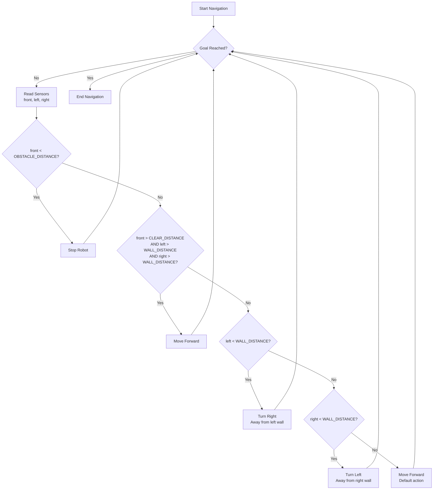

---

# Robotics Systems and Simulation – Mock Exam (New Version)

## Instructions

This is a mock exam for the module **Robotics Systems and Simulation**.

You are required to answer all questions.

There are 15 questions and 100 marks available:

* Ten MCQ (Multiple Choice Questions) worth 5 marks each.
* Three short‑answer questions worth 5 marks each.
* One long mathematical modelling question worth 20 marks.
* One design/pseudo‑code question worth 15 marks.

For the non‑MCQ questions, marks are awarded based on understanding and working.

---

# Section A – Multiple Choice Questions (50 Marks)

## Question 1 (5 Marks)

The main purpose of a **feedback controller** in robotics is to:

* A: Increase CPU clock speed  
* B: Maintain desired system behaviour  
* C: Reduce robot mass  
* D: Increase battery temperature  

Your answer: B

---

## Question 2 (5 Marks)

Which sensor is commonly used to measure **linear acceleration**?

* A: Gyroscope  
* B: Accelerometer  
* C: LIDAR  
* D: Camera 

Your answer: A


---

## Question 3 (5 Marks)

In ROS, a **launch file** is used to:

* A: Compile C++ code  
* B: Start multiple nodes and configurations  
* C: Display robot meshes  
* D: Format log files  

Your answer: B


---

## Question 4 (5 Marks)

A **low‑pass filter** is used to:

* A: Remove high‑frequency noise  
* B: Increase sensor range  
* C: Amplify motor torque  
* D: Generate PWM signals  

Your answer: A


---

## Question 5 (5 Marks)

Which electrical component stores energy in an **electric field**?

* A: Inductor  
* B: Capacitor  
* C: Resistor  
* D: Transistor  

Your answer:


---

## Question 6 (5 Marks)

Which ROS command is used to display the structure of a **TF tree**?

* A: ros2 topic echo  
* B: ros2 run tf2_tools view_frames  
* C: ros2 node info  
* D: ros2 bag record  

Your answer: B


---

## Question 7 (5 Marks)

The main purpose of **path planning** in mobile robots is to:

* A: Increase wheel friction  
* B: Determine a safe route to a goal  
* C: Reduce CPU usage  
* D: Improve battery charging  

Your answer: B


---

## Question 8 (5 Marks)

Which Industrial Revolution introduced **automation using electronics and IT**?

* A: Industry 1.0  
* B: Industry 2.0  
* C: Industry 3.0  
* D: Industry 5.0  

Your answer: C


---

## Question 9 (5 Marks)

A **stereo camera** estimates depth by:

* A: Measuring sound reflections  
* B: Comparing two images from different viewpoints  
* C: Detecting magnetic fields  
* D: Measuring temperature gradients  

Your answer: B


---

## Question 10 (5 Marks)

The main purpose of a **motor driver** in robotics is to:

* A: Store sensor data  
* B: Control power delivered to motors  
* C: Generate 3D maps  
* D: Perform SLAM  

Your answer: B


---

# Section B – Short Questions (15 Marks)

## Question 11 (5 Marks)

Briefly explain what a **ROS node** is and what role it plays in a robotic system.

Please fit your answer in four lines only.

Your answer: 
A ROS node is an executable that performs specific tasks in a robotic system, such as sensing, actuation, or decision-making. It communicates with other nodes using topics, services, and the Parameter Server, forming the backbone of a robot's software architecture


---

## Question 12 (5 Marks)

What is the purpose of the **`/scan`** topic in ROS/Gazebo?


Your answer:
The /scan topic in ROS/Gazebo is used to publish laser scan data from a robot's sensors, allowing other nodes to subscribe to this data for processing and decision-making. This enables the robot to perceive its environment and interact with it effectively.

---

## Question 13 (5 Marks)

Give **two advantages** of using **odometry** for robot navigation.


Your answer:

Odometry is the use of motion sesnors to determine the robots change in position releative to a know postion. This method provides good accuracy for the short-term measurement but it leads to a lot of error when done on significant displacement.

Uses:
* cab be used to estimate the postion to provide better estimats
* Robots can have enough stability so that they are able to detect the landmarks and are used for mapping in the limited region.


Limitations:
Systematic error is caused by inherent deficiencies or inaccuracies in the system such as:
Systematic: 
* Inaccuracies in wheel diameter.
* Inaccuracies in wheelbase.
* Misalignment of wheels.
* Finite encoder resolution.
* Finite encoder sampling rate.

Non-Systematic:
Uneven floor
Presence of unexpected objects on the floor
Wheel Slipperage, Overaccelaration, Fast turning.

---

# Section C – Mathematical Modelling (20 Marks)

## Question 14 (20 Marks)

Derive the mathematical model of the **electrical RLC circuit** shown below, considering the **capacitor voltage v(t)** as the output.

System:

* Input voltage = u(t)  
* Resistance = R  
* Inductance = L  
* Capacitance = C  

Use **Kirchhoff’s Voltage Law** to derive the differential equation.

If you need to write derivatives, use:

* d/dt (v(t))


Your answer:

---

# Section D – Design / Pseudo‑Code (15 Marks)

## Question 15 (15 Marks)

A mobile robot must navigate a corridor using **infrared distance sensors** mounted at the front, left, and right. The robot should:

* Move forward when the path is clear  
* Turn away from nearby walls  
* Stop if an obstacle is directly ahead  
* Continue until a goal condition is met  

As a Mechatronics Engineer, design the navigation logic and write pseudo‑code for this behaviour.

You may answer using:

* Pseudo‑code  
* Flowchart  
* Diagram  
* Combination of all three  


Your answer:

### Pseudo-code

```
# Define sensor thresholds (example values in meters)
CLEAR_DISTANCE = 1.0
WALL_DISTANCE = 0.5
OBSTACLE_DISTANCE = 0.2

# Main navigation loop
while not goal_reached():
    # Read sensor values
    front_distance = read_front_sensor()
    left_distance = read_left_sensor()
    right_distance = read_right_sensor()
    
    # Check for obstacle directly ahead
    if front_distance < OBSTACLE_DISTANCE:
        stop_robot()
    # Check if path is clear
    elif front_distance > CLEAR_DISTANCE and left_distance > WALL_DISTANCE and right_distance > WALL_DISTANCE:
        move_forward()
    # Turn away from nearby left wall
    elif left_distance < WALL_DISTANCE:
        turn_right()
    # Turn away from nearby right wall
    elif right_distance < WALL_DISTANCE:
        turn_left()
    # Default action (path partially clear)
    else:
        move_forward()
```

### Flowchart



# End of Mock Exam

---